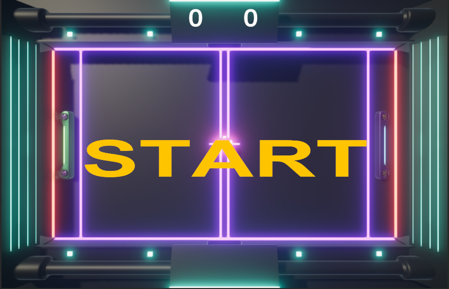
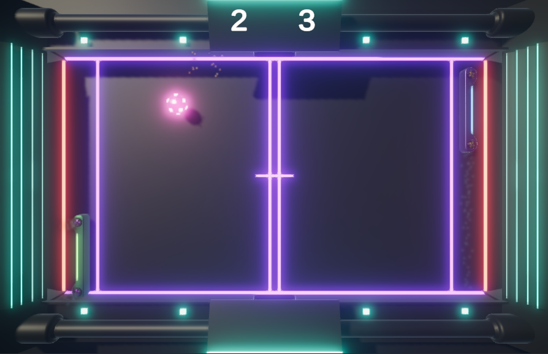
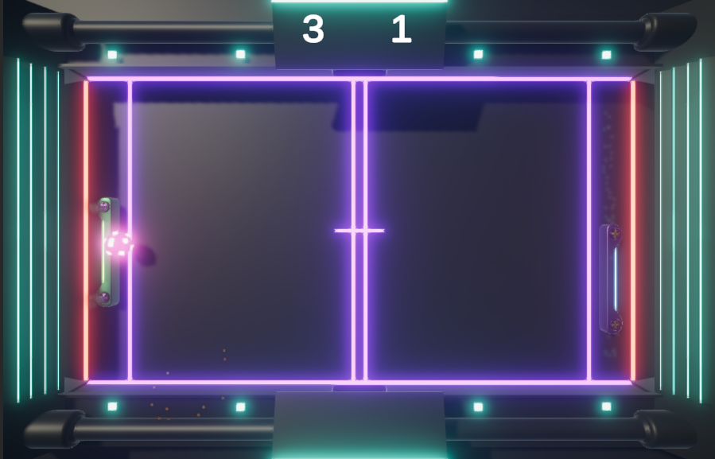

# Unity CyberPong3D Game

It's a fun simple pong game based on Unity. It allows you to play a classic game of pong with two rackets and one ball. One racket is controlled by the computer and you control the other racket.
## Table of Contents

- [Getting Started](#getting-started)
- [Gameplay](#gameplay)
- [Contributing](#contributing)
- [ScreenShots](#screenshots)

## Getting Started

To play the game, follow these steps:

1. Clone the repository to your local machine.
2. Open the project in Unity, which uses the C# programming language.
3. Navigate to the starting scene or level.
4. Run the game by clicking the "Play" button in the Unity Editor.

## Gameplay

- Press the spacebar to start the game.
- Use the **up** and **down** arrow keys to control the left racket.
- The game keeps track of the score for both players.
- The ball's movement is random, making each round of the game unique and unpredictable.
- The first player to reach a certain score wins.

## Contributing

Contributions are welcome! If you'd like to contribute to the project, please follow these steps:

1. Fork the repository.
2. Create a new branch for your feature or bug fix.
3. Make your changes and test them thoroughly.
4. Submit a pull request with a clear description of your changes.

## ScreenShots

    
    
   

